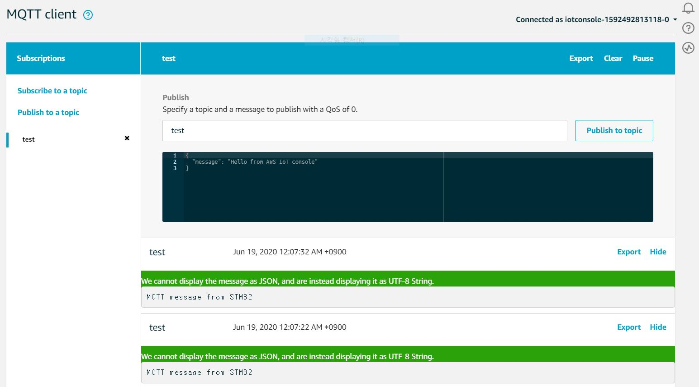

# SMT32_HAL_AWS_IOT
AWS IOT prototype for STM32F4

1. Reference
- https://www.eclipse.org/paho/
- https://github.com/eclipse/paho.mqtt.embedded-c
- https://www.instructables.com/id/How-to-implement-embedded-Mqtt-Client-using-W5500-/
- http://blog.naver.com/pcppcp454/221380882726

2. Tutorial (Written in Korean)
 - https://blog.naver.com/eziya76/222006275453

3. Environments
- NUCLEO-F429ZI
- STM32CubeMx 5.6.1 
- STM32F4 HAL Driver 1.25.0
- STM32CubeIDE 1.3.1 

4. Issues
 - mbedTLS returns error without compiler optimization level 1(O1) option
 - mbedtls_ssl_conf_read_timeout doesn't work properly.
 
5. Test
 - Create & Download certificates from Amazon IOT
 - Write client certificate & private key to MQTTInterface.c
 - Write your endpoint address to mqtt_task.c
 - Debug
 
 6. Test Video
  - https://youtu.be/HgoDnCgEJqc
 
 
